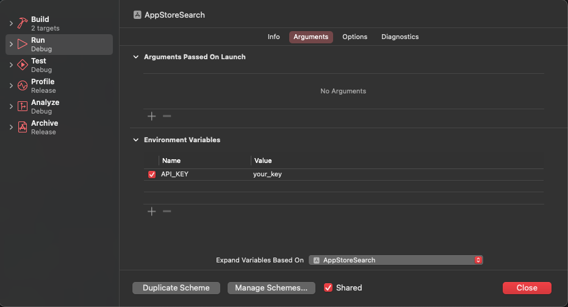

## ProcessInfo

`ProcessInfo`는 현재 실행 중인 프로세스나 애플리케이션에 대한 정보를 제공하는 Swift의 클래스로 Swift 프로그램의 다양한 속성과 환경 관련 데이터에 대한 액세스를 제공한다. 

### 1. APIConfig 파일 생성

APIConfig 파일을 생성후 api토큰을 상수로 선언한다

```swift
struct APIConfig {
    static let apiKey = ProcessInfo.processInfo.environment["API_KEY"]
}
```

### 2. 환경 변수 설정

다음으로, 개발 환경에서 API 토큰을 환경 변수로 설정한다. XCode 를 활용하는 방법과 터미널을 활용하는 방법 두가지가 있다


#### Xcode 사용: 
Project Edit Scheme 을 열고  
Environment Variables에 직접 APIKey 를 입력한다

   

#### 터미널 사용:
해당 커맨드를 입력하고 환경변수를 설정한다
```shell
export API_KEY=your_key
```

### 3. 코드에서 환경변수에 접근
```swift
if let apikey = APIConfig.apiKey {
    // API 키를 활용하여 API request를 요청한다
}
```
