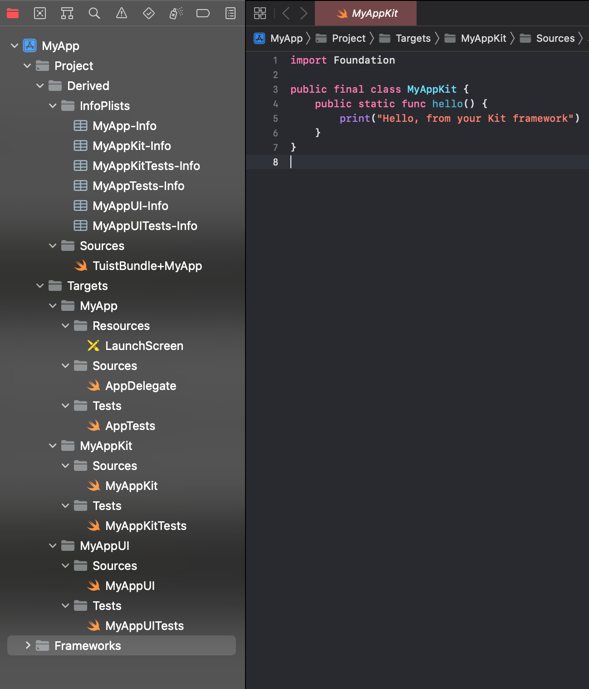

# Tuist?   

Tuist는 Xcode 프로젝트의 복잡성을 관리하는 데 도움이 되는 Swift 개발자를 위한 명령줄 도구이다.   
이를 통해 개발자는 Swift 코드를 사용하여 간단하고 선언적인 방식으로 프로젝트 구조, 대상 및 종속성을 정의할 수 있습니다. Tuist는 Project.swift 파일에 정의된 구성을 기반으로 Xcode 프로젝트를 생성하여 크고 복잡한 프로젝트를 보다 쉽게 ​​관리할 수 있다.   
또한 종속성 관리, 코드 생성 및 작업 공간 설정과 같은 작업에 도움이 되므로 모든 Swift 프로젝트에 유용한 도구이다.

## installation
터미널에 다음 커맨드를 입력한다
```shell
curl -Ls https://install.tuist.io | bash
```
## Make a Project
디렉토리 만들기
```shell
mkdir MyApp cd MyApp
```
프로젝트 실행하기
```shell
tuist init -- platform ios
```
프로젝트 생성하기
```shell
tuist generate
```
그러면 모범 사례를 따르는 기본 구조로 새 iOS 프로젝트가 생성된다. 프로젝트에는 소스 코드를 추가할 수 있는 Sources 디렉토리와 단위 테스트를 위한 Tests 디렉토리가 있다.
   
##Dependencies

다음으로 SPM(Swift Package Manager)을 사용하여 프로젝트에 몇 가지 종속성을 추가해보겠다.
프로젝트 디렉터리의 루트에 Package.swift 파일을 생성하여 종속성을 추가할 수 있다.   
ex)

```swift
import PackageDescription

let package = Package(
    name: "MyProject",
    products: [
        .library(name: "MyLibrary", targets: ["MyLibrary"]),
    ],
    dependencies: [
        .package(url: "https://github.com/Alamofire/Alamofire.git", from: "5.4.0"),
    ],
    targets: [
        .target(
            name: "MyLibrary",
            dependencies: [
                .product(name: "Alamofire", package: "Alamofire"),
            ]),
        .testTarget(
            name: "MyLibraryTests",
            dependencies: ["MyLibrary"]),
    ]
)
```
이 예에서는 MyLibrary 대상에 대한 종속성으로 Alamofire 라이브러리를 추가한다. Tuist는 tuist generate 명령을 실행할 때 종속성을 자동으로 가져오고 관리한다.


## Project Settings

Tuist를 사용하면 Project.swift 파일을 사용하여 프로젝트를 구성할 수 있다. 이 파일은 빌드 설정, 대상, 체계 등을 정의하는 데 사용할 수 있다. 예를 들면 다음과 같다.

```swift
import ProjectDescription

let project = Project(
    name: "MyProject",
    organizationName: "MyOrganization",
    targets: [
        Target(
            name: "MyApp",
            platform: .iOS,
            product: .app,
            bundleId: "com.myorg.myapp",
            infoPlist: .default,
            sources: ["Sources/**"],
            dependencies: [
                .target(name: "MyLibrary"),
            ],
            settings: [
                .base: [
                    "DEVELOPMENT_TEAM": "ABC123",
                    "CODE_SIGN_STYLE": "Automatic",
                ],
                .debug: [
                    "SWIFT_OPTIMIZATION_LEVEL": "-Onone",
                ],
                .release: [
                    "SWIFT_OPTIMIZATION_LEVEL": "-O",
                ],
            ]
        ),
        Target(
            name: "MyLibrary",
            platform: .iOS,
            product: .staticLibrary,
            bundleId: "com.myorg.mylibrary",
            infoPlist: .default,
            sources: ["Sources/MyLibrary/**"],
            settings: [
                .base: [
                    "ENABLE_TESTABILITY": "YES",
                ],
                .debug: [
                    "SWIFT_OPTIMIZATION_LEVEL": "-Onone",
                ],
                .release: [
                    "SWIFT_OPTIMIZATION_LEVEL": "-O",
                ],
            ]
        ),
    ]
)
```
이 예에서는 MyApp 및 MyLibrary라는 두 개의 대상을 정의한다.  
 또한 DEVELOPMENT_TEAM을 포함하여 각 대상에 대한 몇 가지 빌드 설정을 정의한다.