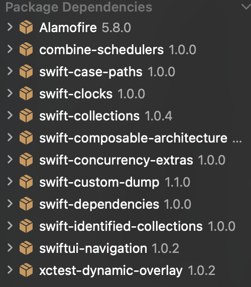

## Tuist로 외부 의존성 주입하기

### 1. 프로젝트 파일 열기
우선 터미널에서 프로젝트 디렉토리로 진입해준 다음  
Project.swift 파일을 열어준다
```shell
cd MyApp  

tuist edit
```

### 2. packages 스키마 수정

`project` 와 `target` 에 각각 추가하려고 하는 SPM의 package URL을 넣어주고 타겟 버전도 설정해준다
```swift
let project = Project(
    name: "MyApp",
    organizationName: "com.team",
    packages: [
        .package(url: "https://github.com/pointfreeco/swift-composable-architecture.git", from: "1.2.0"),
        .package(url: "https://github.com/Alamofire/Alamofire", from: "5.8.0")],
    targets: [
        .init(
            name: name,
            platform: .iOS,
            product: .app,
            bundleId: "com.team.MyApp",
            deploymentTarget: .iOS(targetVersion: "16.0",
                                   devices: .iphone,
                                   supportsMacDesignedForIOS: true),
            infoPlist: .extendingDefault(with: infoPlist),
            sources: ["Targets/MyApp/Sources/**"],
            resources: ["Targets/MyApp/Resources/**"],
            dependencies: [.package(product: "swift-composable-architecture"),
                           .package(product: "Alamofire")],
            settings: .settings(base: ["DEVELOPMENT_TEAM": "team"])
        ),
    ]
)
```

### 3. 프로젝트 generate
다시 터미널로 돌아와 tuist 를 통해 프로젝트를 생성해주면  
package들이 resolve되며 추가된다
```shell
tuist generate
```
  


